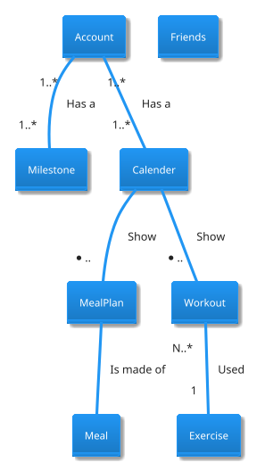
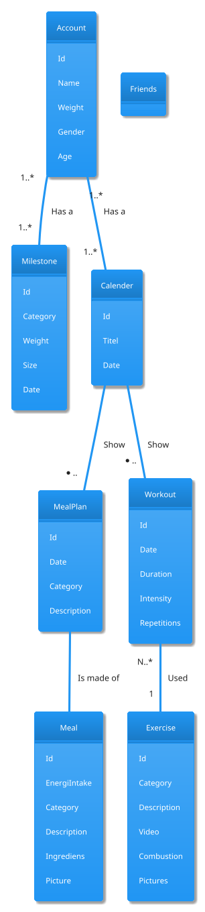

# Analysing Nouns

For at opretholde en sund **livsstil** er **træning** en vigtig del af hverdagen (sundhed.dk 2014). Hertil medfølger udfordringer med at strukturere sin **træning**, eksempelvis en **plan** for hvilke **øvelser** man udfører på en given **dag**, samt **varighed** og **intensitet** af disse. Desuden er det vigtigt at være vedholdende, og få løbende **feedback** på sin **milepæl**. Foruden **træning** er **kosten** en vigtig **del**, hvor en milepæl kunne være at holde styr på sit **energiindtag**, for at eller øge **vægt**. **Motivation** for at træne og opdage nye **øvelser** kan ofte findes blandt ligesindede og **venner** (Træning 2011), hvortil en fælle og let tilgængelig **platform** kan hjælpe med dette.

**Web-applikationen** vil fungere som et alternativ for en **personlig træner**, således det er nemmere at starte sin **personlige træningsrejse** og opnå sin **milepæle** uden at være nødsaget til at investere **penge** i det. **Web-applikationen** vil indeholde **visuelle features**, som skal hjælpe med at motivere **brugeren**, til at opnå sine **milepæle**.

Som følge af problemstillingerne, vil gruppen fremstille og præsentere en **Web-applikation** med tilhørende **database**. **Web-applikationen** vil bestå af fanerne **login**, **kalender**, **træning**, **diet**, **milepæle** og **indstillinger** Se Figur 1 og Figur 2, samt beskrivelserne længere nede (indsæt ref).

Der vil i **Web-aplikationen** være mulighedfor at se **øvelser** med **forklaringer** og **video**. Desuden vil det være muligt at se en **kalender** indeholdende ens **trænningspas** og **madplaner**. Dette skal give anledning til at kunne dokumentere sit **kalorieindtag**, og få guidelines til **makrofordeling**, som er reguleret efter **brugerens** **træningsrytme**.

## Web-applikationens sider

### Loginpage

Består af FATT-logo, Email flet, Password flet og et sign up new user flet

#### Signup page
  
Består af FATT-logo, Email, Username flet, Password flet og Password flet
  
### Frontpage/Calender

På forsiden vil brugeren kunne se sin kalender, og det er også herfra at bruger vil kunne tilføje måltider og trænningspas

### Trainingpage

På træningsfanen vil brugeren kunne sammensætte øvelser i et trænningspas.

### Dietpage

På kostfanen vil brugeren kunne sammensætte retter i et måltid. Retterne vil kunne kategoriseres efter diettype, for eksempel vegetar, veganer eller ordinær.

### Goalspage

På milepælsfanen vil brugeren kunne oprette mål for enten kost eller øvelser. En milepæl kan for eksempel være en kategori som vægttab, styrke, muskelmasse eller lignene.

### Settingspage

På indstillingsfanen vil brugeren kunne ændre password og ændre relevante indstillinger relateret til brugerens profil. 

## Entity

* User
* Workout
* Øvelse
* Milepæl
* Kosten
* Kalender
* Venner

## Entity to attributes relationship

### User relationship

* Each **user** has a option to adapt their *workout*.
* Each **user** has a *weight*
* Each **user** can have one or more *goals*
* Each **user** can have *gender*
* Each **user** has a *age*
* Each **user** has a *email*
* Each **user** has a *password*

### Workout relationship

* Each **Workout** consists of one or more *exercises*
* Each **Workout** has a accumulated *duration* and *intensity* based on the *exercises*

### exerciser relationship

* Each **exercise** has a *describtion*
* Each **exercise** consists of *category* (arms, back, chest, legs, abs, shoulders)
* Each **exercise** has a *duration*
* Each **exercise** has a *intensity*
* Each **exercise** has as one or more *repetitions*
* Each **exercise** has as one or more *sets*
* Each **exercise** can have a *picture*
* Each **exercise** can have a *video*

### Milestone relationship

* Each **milestone** has a *category*
* Each **milestone** has a *goal*
* Each **milestone** has a *startdate*
* Each **milestone** has a *enddate*

### Meal relationship

* Each **meal** consist of one or more *dishes*
* Each **meal** has a *category*
* Each **meal** has a *describtion*
* Each **meal** has a accumulated *nutritunalvalue* based on dishes

### Dish

* Each **dish** has a *nutritunalvalue*
* Each **dish** has a *category*
* Each **dish** has a *recepie*
* Each **dish** consists of *ingridients*
* Each **dish** har et *picture*

### Kalender relationship

* Each **calender** consists of one or more *workouts*
* Each **calender** consists of one or more *meals*

### Friends relationship

* Each **user** can have on or more *friends*

### Relationship between entities

## Domain Model without attributes

## Domain Model with attributes

