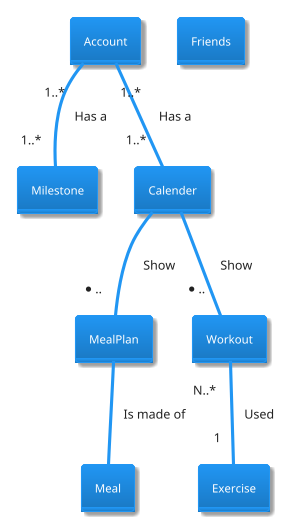
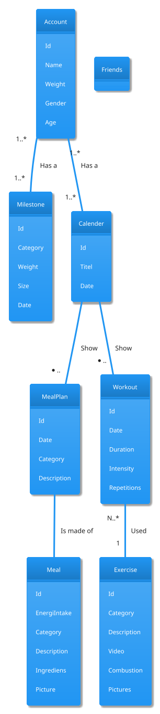

# Analysing Nouns

For at opretholde en sund **livsstil** er **træning** en vigtig del af hverdagen (sundhed.dk 2014). Hertil medfølger udfordringer med at strukturere sin **træning**, eksempelvis en **plan** for hvilke **øvelser** man udfører på en given **dag**, samt **varighed** og **intensitet** af disse. Desuden er det vigtigt at være vedholdende, og få løbende **feedback** på sin **milepæl**. Foruden **træning** er **kosten** en vigtig **del**, hvor en milepæl kunne være at holde styr på sit **energiindtag**, for at eller øge **vægt**. **Motivation** for at træne og opdage nye **øvelser** kan ofte findes blandt ligesindede og **venner** (Træning 2011), hvortil en fælle og let tilgængelig **platform** kan hjælpe med dette.

**Web-applikationen** vil fungere som et alternativ for en **personlig træner**, således det er nemmere at starte sin **personlige træningsrejse** og opnå sin **milepæle** uden at være nødsaget til at investere **penge** i det. **Web-applikationen** vil indeholde **visuelle features**, som skal hjælpe med at motivere **brugeren**, til at opnå sine **milepæle**.

Som følge af problemstillingerne, vil gruppen fremstille og præsentere en **Web-applikation** med tilhørende **database**. **Web-applikationen** vil bestå af fanerne **login**, **kalender**, **træning**, **diet**, **milepæle** og **indstillinger** Se Figur 1 og Figur 2, samt beskrivelserne længere nede (indsæt ref).

Der vil i **Web-aplikationen** være mulighedfor at se **øvelser** med **forklaringer** og **video**. Desuden vil det være muligt at se en **kalender** indeholdende ens **trænningspas** og **madplaner**. Dette skal give anledning til at kunne dokumentere sit **kalorieindtag**, og få guidelines til **makrofordeling**, som er reguleret efter **brugerens** **træningsrytme**.

## Web-applikationens sider

### Loginpage

Består af FATT-logo, Email flet, Password flet og et sign up new user flet

#### Signup page
  
Består af FATT-logo, Email, Username flet, Password flet og Password flet
  
### Frontpage/Calender

På forsiden vil brugeren kunne se sin kalender, og det er også herfra at bruger vil kunne tilføje måltider og trænningspas

### Trainingpage

På træningsfanen vil brugeren kunne sammensætte øvelser i et trænningspas.

### Dietpage

På kostfanen vil brugeren kunne sammensætte retter i et måltid.

### Goalspage

På milepælsfanen vil brugeren kunne oprette mål for enten kost eller øvelser.

### Settingspage

På indstillingsfanen vil brugeren kunne ændre password og ændre relevante indstillinger relateret til brugerens profil. 

## Nouns

* Bruger
* Livstil
* Træning
* Plan
* Øvelser
* Dag
* Varighed
* Intensitet
* Feedback
* Kost
* Del
* Energiindtag
* Vægt
* Motivation
* Venner
* Platform
* Web-applikation
* Database
* Loginside
* Login
* Personlig startside
* Kostplan
* Startside
* Navigations-menu
* Fanerne
* Personligtræner
* Personlig træningrejse
* Penge
* Tid
* Visuelle features
* Prædefineret øvelser
* Træningsprogram
* Forklaring
* Video
* Egne øvelser
* Træningsforløb
* Milepæle
* Træningsrutine
* Udvidelse
* Kalorieindtag
* Makrofordeling
* Træningsrymte

## Nouns removeal of useless words

* Bruger
* Livstil
* Træning
* Plan
* Øvelser
* Dag
* Varighed
* Intensitet
* Feedback
* Kost
* Del
* Energiindtag
* Vægt
* Motivation
* Venner
* Platform
* Personlig startside
* Kostplan
* Personligtræner
* Personlig træningrejse
* Penge
* Tid
* Visuelle features
* Prædefineret øvelser
* Træningsprogram
* Forklaring
* Video
* Egne øvelser
* Træningsforløb
* Milepæle
* Træningsrutine
* Udvidelse
* Kalorieindtag
* Makrofordeling
* Træningsrymte

## Entity

* User
* Workout
* Øvelse
* Milepæl
* Kosten
* Kalender
* Venner

## Entity to attributes relationship

### User relationship

* Hver **User** har mulighed til at tilpasse sin *Workout*.
* Hver **User** har en *vægt*
* Hver **User** har en *milepæle*
* Hver **User** har et *køn*
* Hver **User** har en *alder*
* Hver **User**

### Workout relationship

* Hver **Workout** består af en eller flere *exercises*
* Hver **Workout** har en samlet *varighed* og *intensitet* baseret på de exercises, den består af

### exerciser relationship

* Hver **exercise** har en *forklaringer*
* Hver **exercise** kan have en *video*
* Hver **exercise** består af en *category* (arms, back, chest, legs, abs, shoulders)
* Hver **exercise** har en samt *varighed*
* Hver **exercise** består af en *intensitet*
* Hver **exercise** kan have et *billedet*
* Hver **exercise** består af et antal *gentagelser*
* Hver **exercise** består af et antal *sæt*

### Milepæle relationship

* Hver **milepæle** har en type (vægttab, styrke, muskelmasse osv.) (mangler i projektbeskrivelsen)
* Hver **milepæle** har en ønsket *vægt*
* Hver **milepæle** har en *dato*

### Madplan (Kosten) relationship

* Hver **madplan** består af en eller flere måltider (mangler i projektbeskrivelsen)
* Hver **madplan** har en *kategori* (vegatar, veganer, alm) (mangler i projektbeskrivelsen)
* Hver **madplan** har en *beskrivelse* (mangler i projektbeskrivelsen)
* Hver **madplan** (kost) har en *energiindtag*

### Måltid (MealPlan)

* Hver **måltid** (kost) har en *energiindtag*
* Hver **måltid** har en *kategori* (vegatar, veganer, alm) (mangler i projektbeskrivelsen)
* Hver **måltid** har en *beskrivelse* (mangler i projektbeskrivelsen)
* Hver **måltid** består af *ingredienser*
* Hver **måltid** har et *billedet*

### Kalender relationship

* Hver består af en Workout, start tidspunkt og slut tidspunkt
* Hver består af en Meal, start tidspunkt og slut tidspunkt

### Venner relationship

* Hver 

### Relationship between entities

## Domain Model without attributes

## Domain Model with attributes

