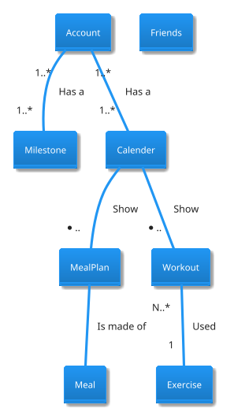
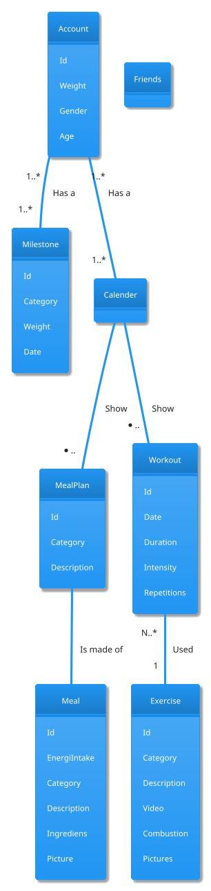

# Analysing Nouns

For at opretholde en sund **livsstil** er **træning** en vigtig del af hverdagen (sundhed.dk 2014). Hertil medfølger udfordringer med at strukturere sin **træning**, eksempelvis en **plan** for hvilke **øvelser** man udfører på en given **dag**, samt **varighed** og **intensitet** af disse. Desuden er det vigtigt at være vedholdende, og få løbende **feedback** på sin **træning**. Foruden **træning** er **kosten** en vigtig **del**, især at holde styr på sit **energiindtag**, hvis man ønsker at tabe eller øge **vægt**. **Motivation** for at træne og opdage nye **øvelser** kan ofte findes blandt ligesindede og **venner** (Træning 2011), hvortil en fælle og let tilgængelig **platform** kan hjælpe med dette.

Som følge af problemstillingerne, vil gruppen fremstille og præsentere en **Web-applikation** med tilhørende **database**. **Web-applikationen** vil først præsentere en **loginside**, hvor **bruger** enten kan oprette sig eller logge ind med et eksisterede **login**. Herefter præsenteres **brugeren** for sin **personlige startside**, hvorpå der blandt andet kan vises **kalenderen** med **brugerens personlige træningsplan** og eventuelle **kostplan**. Foruden **startsiden** findes der i **navigations-menuen** links til **fanerne** vedrørende **træning**, **kost** og **venner**. Se Figur 1 og Figur 2

**Hjemmesiden** vil fungere som et alternativ for en **personlig træner**, således det er nemmere at starte sin **personlige træningsrejse** uden at være nødsaget til at investere **penge** og **tid** i det. **Web-applikationen** vil indeholde **visuelle features**, som skal hjælpe med at motivere **brugeren**. Dette er bl.a. **prædefineret øvelser** eller **træningsprogrammer** med **forklaringer** og **video**, men også mulighed for at oprette **egne øvelser**, til at tilpasse sin **personlige træningsplan**. Desuden vil det være muligt at se **historik** over ens **træningsforløb** med tilhørende **milepæle** for at øge **motivationen** til at fastholde en god **træningsrutine**. Der vil senere hen være mulighed for **udvidelse**, som sætter fokus på **kost**. Dette skal give anledning til at kunne dokumentere sit **kalorieindtag**, og få guidelines til **makrofordeling**, som er reguleret efter **brugerens** **træningsrytme**.

## Nouns

* Bruger
* Livstil
* Træning
* Plan
* Øvelser
* Dag
* Varighed
* Intensitet
* Feedback
* Kost
* Del
* Energiindtag
* Vægt
* Motivation
* Venner
* Platform
* Web-applikation
* Database
* Loginside
* Login
* Personlig startside
* Kostplan
* Startside
* Navigations-menu
* Fanerne
* Personligtræner
* Personlig træningrejse
* Penge
* Tid
* Visuelle features
* Prædefineret øvelser
* Træningsprogram
* Forklaring
* Video
* Egne øvelser
* Træningsforløb
* Milepæle
* Træningsrutine
* Udvidelse
* Kalorieindtag
* Makrofordeling
* Træningsrymte

## Nouns removeal of useless words

* Bruger
* Livstil
* Træning
* Plan
* Øvelser
* Dag
* Varighed
* Intensitet
* Feedback
* Kost
* Del
* Energiindtag
* Vægt
* Motivation
* Venner
* Platform
* Personlig startside
* Kostplan
* Personligtræner
* Personlig træningrejse
* Penge
* Tid
* Visuelle features
* Prædefineret øvelser
* Træningsprogram
* Forklaring
* Video
* Egne øvelser
* Træningsforløb
* Milepæle
* Træningsrutine
* Udvidelse
* Kalorieindtag
* Makrofordeling
* Træningsrymte

## Entity

* Bruger
* Plan
* Træningprogram
* Øvelse
* Milepæl
* Kosten
* Kalender
* Venner

## Entity to attributes relationship

### Bruger relationship

* Hver **bruger** har mulighed for at oprette egne *øvelser*
* Hver **bruger** har mulighed til at tilpasse sin *personlige træningsplan*.
* Hver **bruger** har en *vægt*
* Hver **bruger** har en *milepæle* (mangler i projektbeskrivelsen)
* Hver **bruger** har et *køn* (mangler i projektbeskrivelsen)
* Hver **bruger** har en *alder* (mangler i projektbeskrivelsen)
* Hver **bruger**

### Træningsprogram relationship

* Hver (plan) **træningsprogram** består af *øvelser*
* Hver (plan) **træningsprogram** har en given *dag*, samt *varighed* og *intensitet*
* Hver **træningsprogram** består af et antal *gentagelser* (mangler i projektbeskrivelsen)

### Øvelser relationship

* Hver (prædefineret) **øvelser** har en *forklaringer* og *video*
* Hver **øvelser** består af en *kategori* (arms, back, chest, legs, abs, shoulders)(mangler i projektbeskrivelsen)
* Hver **øvelse** består af en *forbænding*
* Hver **øvelse** har et *billedet*

### Milepæle relationship

* Hver **milepæle** har en type (vægttab, styrke, muskelmasse osv.) (mangler i projektbeskrivelsen)
* Hver **milepæle** har en ønsket *vægt*
* Hver **milepæle** har en *dato*

### Madplan (Kosten) relationship

* Hver **madplan** består af en eller flere måltider (mangler i projektbeskrivelsen)
* Hver **madplan** har en *kategori* (vegatar, veganer, alm) (mangler i projektbeskrivelsen)
* Hver **madplan** har en *beskrivelse* (mangler i projektbeskrivelsen)
* Hver **madplan** (kost) har en *energiindtag*

### Måltid (MealPlan)

* Hver **måltid** (kost) har en *energiindtag*
* Hver **måltid** har en *kategori* (vegatar, veganer, alm) (mangler i projektbeskrivelsen)
* Hver **måltid** har en *beskrivelse* (mangler i projektbeskrivelsen)
* Hver **måltid** består af *ingredienser*
* Hver **måltid** har et *billedet*

### Kalender relationship

* Hver
Desuden vil det være muligt at se historik over ens træningsforløb med tilhørende milepæle for at øge motivationen til at fastholde en god træningsrutine

### Venner relationship

* Hver

### Relationship between entities

## Domain Model without attributes

## Domain Model with attributes

